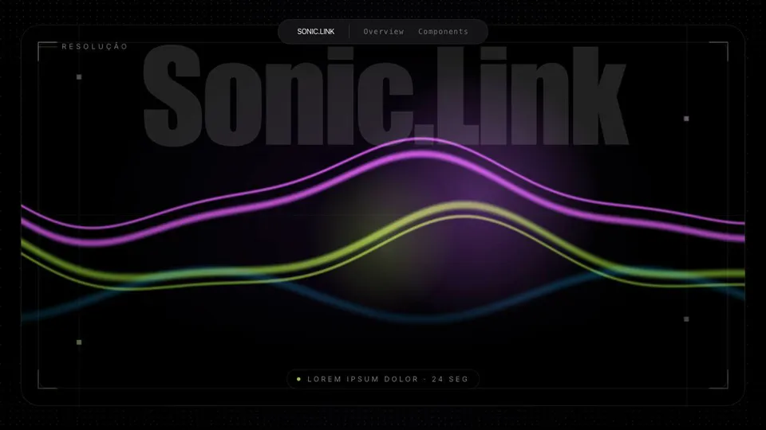

# Extract DS

**Extract DS é uma skill para agentes de IA que transforma um site pronto em um
design system navegável e reutilizável.**

Você aponta o agente para a pasta local de uma página já finalizada. Ele devolve
um catálogo visual baseado no próprio site, no qual é possível rever a
experiência original e explorar os elementos que formam sua interface. Tudo
isso sem trocar a identidade da marca por um template genérico e sem reconstruir
a página do zero.



## O que você recebe

O resultado reúne duas áreas no mesmo catálogo:

- **Overview:** o site original adaptado para apresentar seu próprio design
  system, preservando layout, identidade, interações e animações principais.
- **Components:** uma biblioteca visual extraída do Overview aprovado, com
  tipografia, cores, backgrounds e componentes reais encontrados na página.

O catálogo final fica em uma nova pasta chamada
`<marca>-design-system/`, separado do projeto original.

## Como funciona

1. A skill entende rapidamente como o site está organizado e como ele deve ser
   aberto.
2. Copia o projeto e prepara o **Overview**, reutilizando o código e os assets
   existentes.
3. Mostra o Overview para você revisar e aguarda sua aprovação.
4. Depois da aprovação, extrai e organiza a área de **Components**.
5. Mostra o catálogo completo para uma segunda revisão.

Esse processo em duas etapas evita gastar tempo documentando uma página que
ainda não foi aprovada. Você valida primeiro a reprodução do site e só então a
biblioteca de componentes.

## O que a skill preserva

- a identidade visual da marca;
- a estrutura e o comportamento da página;
- a navbar existente, adaptada para navegar entre Overview e Components;
- animações, efeitos e backgrounds que definem a experiência; e
- HTML, CSS, classes, assets e estados reais do projeto.

A copy comercial é substituída por uma apresentação neutra do design system e
por Lorem Ipsum. O objetivo é documentar a interface, não manter o conteúdo da
campanha original.

## Instalação

Clone este repositório:

```bash
git clone https://github.com/rtadewald/skills.git
```

Depois copie a pasta `extract-ds` para o diretório de skills do seu agente.

Para agents que usam `~/.agents/skills`:

```bash
mkdir -p ~/.agents/skills
cp -R skills/extract-ds ~/.agents/skills/
```

Para Claude Code:

```bash
mkdir -p ~/.claude/skills
cp -R skills/extract-ds ~/.claude/skills/
```

Se o repositório já estiver clonado dentro do diretório de skills, nenhuma cópia
adicional é necessária.

## Como usar

Informe o caminho da pasta que contém o site pronto:

```text
Use $extract-ds no projeto "/caminho/absoluto/para/o-site".
```

Em clientes que disponibilizam skills como comandos:

```text
/extract-ds "/caminho/absoluto/para/o-site"
```

Mantenha caminhos com espaços ou parênteses entre aspas.

## Servidor ou arquivo local

Se o projeto já abre diretamente como arquivo local, a skill mantém esse modo.
Se ele depende de um servidor, ela explica isso antes de começar e pergunta se
você prefere:

- manter o funcionamento atual e receber o Overview mais rapidamente; ou
- adaptar o projeto para abrir sem servidor, quando isso for viável.

A conversão é opcional porque alguns sites dependem do servidor para carregar
módulos, dados ou animações.

## Estrutura da entrega

```text
<marca>-design-system/
├── design-system.html
└── assets/
    └── overview/
        └── ...cópia funcional do projeto original
```

`design-system.html` é a entrada do catálogo e contém a navegação entre
**Overview** e **Components**.
